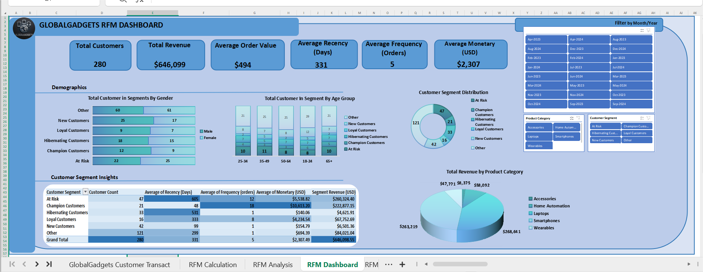

# GlobalGadgets Customer RFM Analysis & Segmentation

## Project Overview

This project showcases a comprehensive Customer Segmentation analysis for an e-commerce business, **GlobalGadgets**, utilizing the powerful RFM (Recency, Frequency, Monetary) methodology. The primary goal was to transform raw transactional data into actionable customer insights, enabling targeted marketing strategies and improved business outcomes.

## Business Value of RFM Analysis

In today's data-driven landscape, understanding customer behavior is paramount. RFM analysis provides a robust framework by segmenting customers based on three key dimensions of their purchasing activity:
* **Recency (R):** How recently did a customer make a purchase? (More recent customers are generally more engaged.)
* **Frequency (F):** How often do they purchase? (Frequent buyers indicate loyalty.)
* **Monetary (M):** How much money do they spend? (High spenders represent significant value.)

By categorizing customers into distinct RFM segments (e.g., Champions, Loyal, At-Risk), businesses can:
* **Personalize Marketing:** Tailor campaigns and offers to specific customer needs.
* **Improve Retention:** Identify and re-engage at-risk customers before they churn.
* **Optimize Resource Allocation:** Focus marketing spend on high-value segments.
* **Enhance Customer Lifetime Value (CLV):** Develop strategies to move customers up the loyalty ladder.

## Tools Used

* **Excel Spreadsheets :** For all data cleaning, transformation, RFM calculations, segmentation, and dashboard creation.
* **PivotTables & PivotCharts:** For dynamic data summarization and visualization.
* **Slicers:** For interactive filtering on the dashboard.
* **Conditional Formatting:** For visual emphasis in data tables.

## Data Source

The analysis is based on a simulated transactional dataset for GlobalGadgets, named `GlobalGadgets-Full_Data.csv`. It includes:
* `Transaction ID`, `Customer ID`, `Transaction Date`, `Product ID`, `Product Category`, `Quantity`, `Unit Price`.
* Crucially, **demographic data** (`Gender`, `Age`) is included to enrich the segmentation insights.

## Methodology & Key Steps

1.  **Data Preparation:**
    * Loaded raw `GlobalGadgets-Full_Data.csv` into Excel.
    * Handled missing values in `Quantity` and `Unit Price` columns using their Average Values.
    * Created a `Total Price` column (`Quantity * Unit Price`).
    * Generated a `Month_Year` column from `Transaction Date` for easy time-based filtering.

2.  **RFM Calculation (`RFM Calculations` Sheet):**
    * Extracted a unique list of `Customer ID`s.
    * Used `VLOOKUP` to bring in `Gender` and `Age` for each unique customer.
    * Created an `Age Group` column from `Age` using `IFS` statements for demographic segmentation.
    * Calculated **Recency (Days)**: Days since last purchase (using `Snapshot Date` derived from `MAX(Transaction Date)`).
    * Calculated **Frequency (Orders)**: Total number of transactions per customer.
    * Calculated **Monetary (USD)**: Total revenue generated per customer.

3.  **RFM Scoring:**
    * Assigned scores (1-5) for Recency, Frequency, and Monetary using `PERCENTRANK.INC` and `ROUNDUP` functions, ensuring lower Recency gets higher scores, and higher Frequency/Monetary get higher scores.
    * Created a combined `RFM Score` (e.g., "555") by concatenating individual scores.

4.  **Customer Segmentation:**
    * Defined strategic customer segments (e.g., 'Champion Customers', 'Loyal Customers', 'New Customers', 'At Risk', 'Hibernating Customers', and 'Other') based on RFM score combinations using `IFS` statements.

5.  **Interactive Dashboard Creation (`RFM Dashboard` Sheet):**
    * Designed a user-friendly dashboard layout.
    * Implemented **Key Performance Indicators (KPIs)**: Total Customers, Total Revenue, Average Order Value, Average Recency, Average Frequency, Average Monetary.
    * Integrated **Slicers** for interactive filtering by `Month_Year`, `Product Category`, and `Customer Segment`.
    * Visualized insights using various **PivotCharts and a direct PivotTable display**:
        * Customer Segment Distribution (Pie Chart)
        * Average RFM Values by Customer Segment (Clustered Column Chart)
        * Customer Segments by Gender (Stacked Column Chart)
        * Customer Segments by Age Group (Stacked Column Chart)
        * Total Revenue by Product Category (Pie Chart)
        * **Customer Segment Insights Table:** A detailed PivotTable providing granular counts, average RFM values, and total revenue per segment, enhanced with conditional formatting.

## Key Insights

* **At Risk Customers** represent the highest revenue pool ($260,324) despite showing significant recency (Avg. 605 days), making them a critical segment for re-engagement.
* **Champion Customers** are highly valuable, demonstrating superior Recency (Avg. 48 days), Frequency (Avg. 18 orders), and Monetary value (Avg. $10,613.20), contributing $222,877.15 in revenue.
* The **'Other' segment** is the largest by count (43% of customers) and contributes notable revenue ($84,021.04). Its diverse profile indicates a need for deeper investigation to unlock potential.
* **New Customers** (15% of base) are recent buyers with lower frequency/monetary values, requiring focused nurturing.
* **Smartphones** and **Laptops** are the primary revenue-generating product categories.
* Demographic analysis reveals varying distributions across segments, e.g., 'New Customers' concentrate in younger age groups, while 'Champions' are present across broader age ranges.

## Recommendations

Based on the customer segmentation, GlobalGadgets should prioritize the following strategies:

* **Prioritize Re-engagement of At-Risk Customers:** Launch aggressive, personalized win-back campaigns leveraging historical data to prevent significant revenue loss.
* **Sustain and Reward Champion Customers:** Implement exclusive VIP programs and early access to maintain loyalty and leverage them for advocacy.
* **Investigate the 'Other' Segment:** Conduct deeper research (surveys, targeted campaigns) to understand this large, diverse group and uncover untapped potential.
* **Accelerate Engagement for New Customers:** Implement automated welcome series with incentives for repeat purchases and product education.
* **Nurture Loyal Customers:** Offer personalized recommendations and tiered benefits to strengthen loyalty and encourage transition to Champion status.
* **Strategize for Hibernating Customers:** Consider cost-effective reactivation efforts while analyzing patterns to prevent future dormancy.
* **Leverage Product Strengths:** Continue emphasizing top-performing categories like Smartphones and Laptops, exploring bundling opportunities.

## How to Explore the Project

1.  **Open Excel Workbook:** Open the `GlobalGadgets_RFM_Analysis_Project.xlsx` file in Microsoft Excel.
2.  **Navigate Sheets:**
    * `GlobalGadgets Customer Transact`: The raw, cleaned transactional data.
    * `RFM Calculation`: Contains the unique customer list with all RFM metrics, scores, segments, and demographics.
    * `RFM Analysis`: Houses the PivotTables and PivotCharts that feed the dashboard.
    * `RFM Dashboard`: The interactive dashboard where you can use the slicers to filter data.
    * `RFM Insights`: Detailed findings and actionable recommendations.
3.  **Interact with the Dashboard:** Use the slicers (Month/Year, Product Category, Customer Segment) on the `RFM Dashboard` sheet to explore the data dynamically.

## Screenshots

**Overall Dashboard View:**

*Connect with me on LinkedIn (https://www.linkedin.com/in/dorischisom) to discuss this project or other data analytics topics!*
